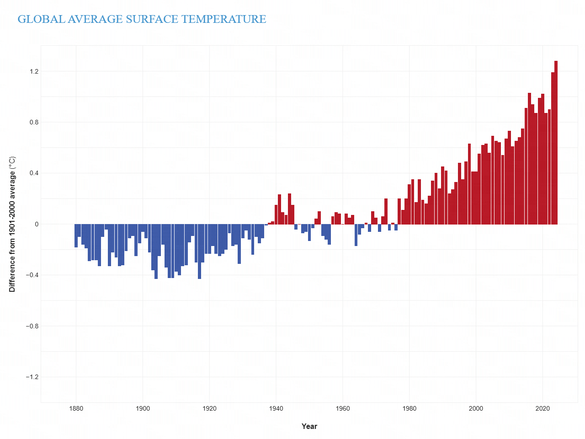
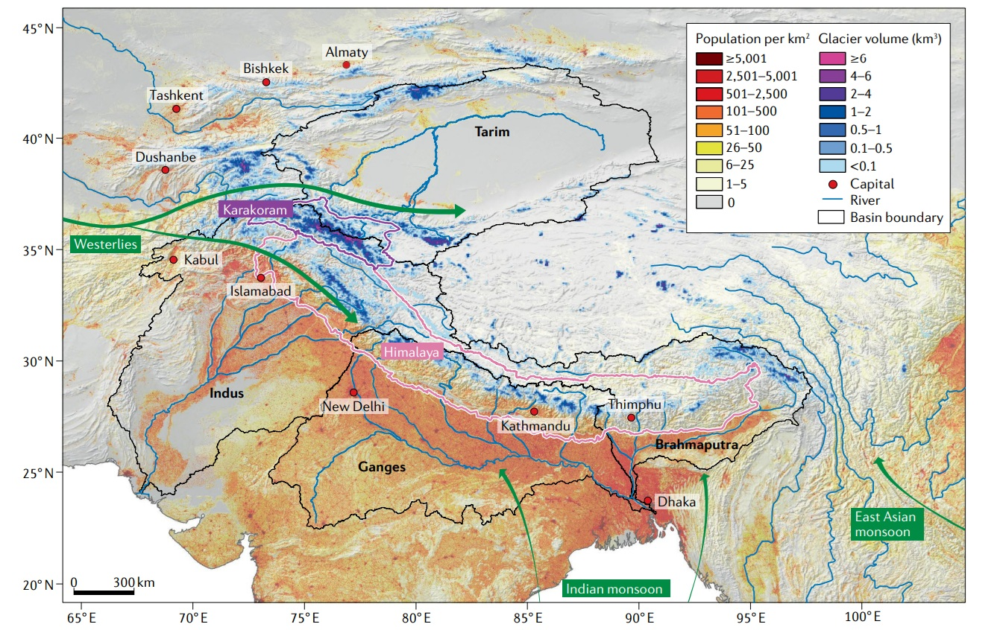
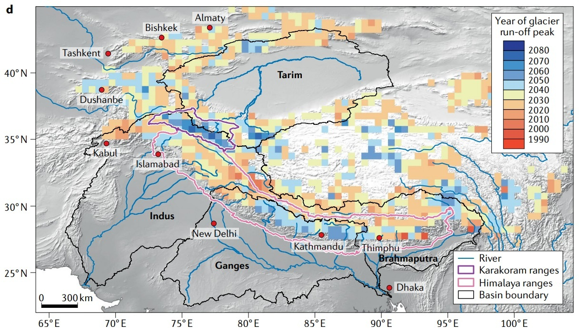
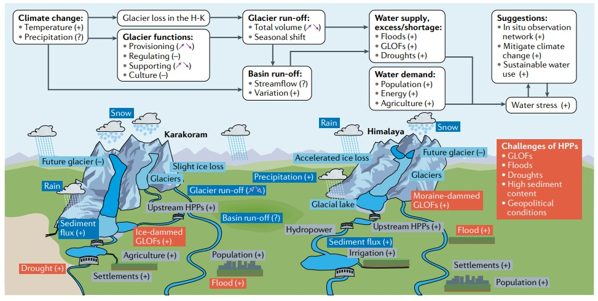
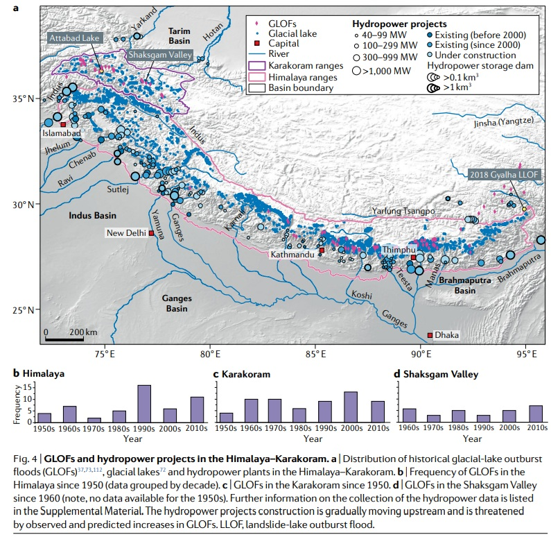
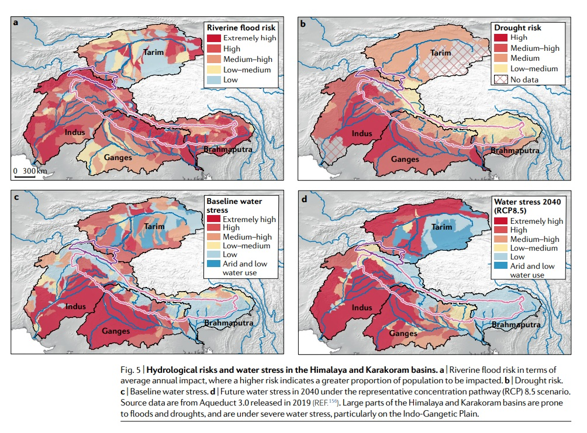
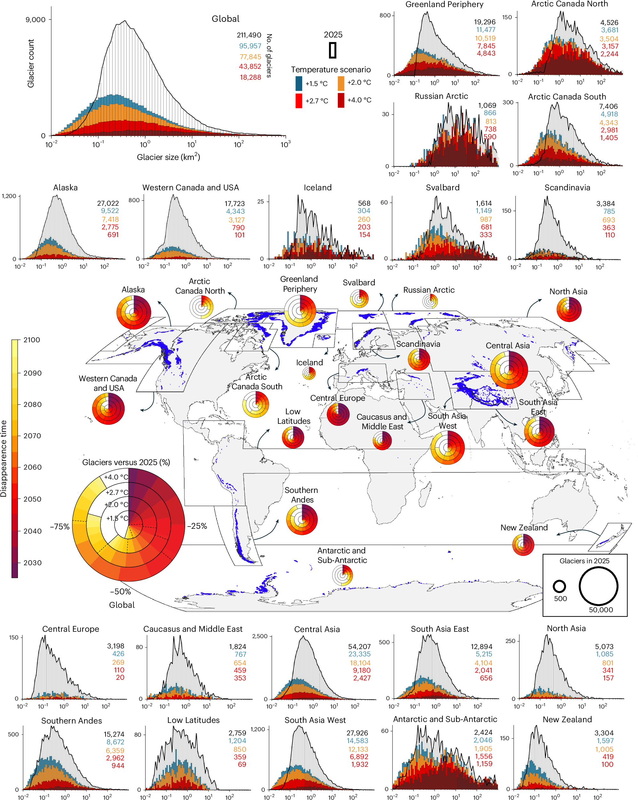

```{=html}
<!-- ============================================================
  TITLE
  ============================================================ -->
```


::: hero-title
[Fate of Himalyan Glaciers and Us]{.hero-heading}

[A journey on what lies ahead for the glacier in Himalaya and how will it impact us?]{.hero-subtitle}

[Ujjwal Nagar]{.hero-author}

[↓]{.scroll-hint}
:::

<span class="cr-source-note hero-image-credit" style="display:block; text-align:right; margin: 0.5rem 2vw 0 0; color:#6b7280; font-size:0.75rem;">By Original: Megaurab09Derivative work: UnpetitproleX - This image has been extracted from another file, CC BY-SA 4.0, <a href="https://commons.wikimedia.org/w/index.php?curid=175733659" target="_blank" style="color:#6b7280; text-decoration:underline;">source</a></span>

```{=html}
<!-- ============================================================
  SECTION 1 — The Big Picture (full-bleed image, overlay-center)
  ============================================================ -->
```

<!-- NASA Video -->
:::: {.cr-section layout="overlay-right" narrative-border-radius="6px" narrative-overlay-max-width="480px"}

Glaciers in Asia are particularly a lifeline to a lot of countries. @cr-glacier-wide

But decade by decade, the ice has retreated. What once seemed permanent is now visibly shrinking. @cr-glacier-wide

::: {#cr-glacier-wide}
```{=html}
<div class="video-container">
  <video controls autoplay loop playsinline preload="auto" data-closeread-video="glacier">
    <source src="images/13243_Asian_Glaciers.webm" type="video/webm">
  </video>
  <div class="video-credits cr-source-note">
    NASA's Goddard Space Flight Center<br>
    <strong>Producer:</strong> Katie Jepson (USRA)<br>
    <strong>Writer:</strong> Carol Rasmussen (NASA/JPL CalTech)<br>
    <strong>Animator:</strong> Bailee DesRocher (USRA)
  </div>
</div>
```
:::
::::

<!-- About Climate Change and Glaciers -->
## Climate Change and Glaciers

Climate change is causing glaciers to melt at an accelerating rate due to rising global temperatures. As atmospheric and surface temperatures increase, glaciers lose more ice through melting than they accumulate from annual snowfall, resulting in their rapid retreat and shrinkage. This process is particularly severe in mountain regions like the Himalayas, where glaciers are sensitive to even small temperature changes. The consequences are far-reaching: reduced glacier volume threatens freshwater supplies for billions of people who depend on glacial meltwater for drinking water, irrigation, and hydroelectric power. Additionally, glacier loss contributes to sea-level rise, alters regional precipitation patterns, and destabilizes mountain ecosystems that have evolved in harmony with these frozen landscapes.


```{=html}
<!-- ============================================================
  SECTION 2 — Climate Change Temperature data
  ============================================================ -->
```

:::: {.cr-section layout="sidebar-left" narrative-background-color-sidebar="#ffffff" narrative-text-color-sidebar="#1a1a2e" section-background-color="#ffffff"}
This chart summarizes global surface temperature anomalies by decade. Each point shows how much warmer or cooler a decade was compared with the 1951–1980 baseline. @cr-temp-code

Early decades sit slightly below zero, which means they were cooler than the baseline. @cr-temp-code

From about 1980 onward, the dots climb quickly and the trend line steepens, showing a sustained warming signal. @cr-temp-code

By the most recent decades, the anomaly approaches or exceeds one degree Celsius, highlighting how rapid the recent warming has been. @cr-temp-code


::: {#cr-temp-code}
{.cr-fit-media width="100%" fig-alt="Global surface temperature anomaly"}

<span class="cr-source-note">Source: NOAA Climate.gov graph, based on data from the National Centers for Environmental Information. https://www.climate.gov/news-features/understanding-climate/climate-change-global-temperature</span>

:::
::::

```{=html}
<!-- ============================================================
  SECTION 3 — How many glaciers are there in India/Himalaya
  ============================================================ -->
```

:::: {.cr-section layout="sidebar-right" narrative-background-color-sidebar="#ffffff" narrative-text-color-sidebar="#1a1a2e" section-background-color="#ffffff"}
India is home to the Himalayas, which has a significant number of glaciers that serve as lifelines for the country. @cr-volume

These glaciers are a lifeline to the vast number of people, living acroos the mountains, valleys and plains thorugh their vast network of rivers. [@cr-volume]{pan-to="18%, 15%" scale-by="2" }

All the big rivers like Ganga, Yamuna Brahmaputra, orginates are fed and sustained by these glaciers. [@cr-volume]{pan-to="0%,-10%" scale-by="2" }

As visble in the map you can see how the volume of glaciers are spread across the himalaya. You can see across India, how much population depends on these glacier for their water resources. @cr-volume

::: {#cr-volume}
{.cr-fit-media width="100%" fig-alt="Glacier volume visualization"}

<span class="cr-source-note">Source: Nie et al., 2021, Nature Reviews Earth & Environment. https://www.nature.com/articles/s43017-020-00124-w</span>
:::

::::

```{=html}
<!-- ============================================================
     SECTION 3B — How much water do they provide
     ============================================================ -->
```

:::: {.cr-section layout="overlay-left" narrative-border-radius="6px" narrative-overlay-max-width="480px"}
This view highlights how glacier mass has shifted over time, revealing where water storage is shrinking fastest. @cr-mass-change

Notice the strongest losses clustered in high-altitude regions that once acted as natural reservoirs. @cr-mass-change

That declining mass translates directly into less reliable meltwater downstream. @cr-mass-change

::: {#cr-mass-change}
{width="100%" fig-alt="Glacier mass change across the Himalaya"}

<span class="cr-source-note">Source: Nie et al., 2021, Nature Reviews Earth & Environment. https://www.nature.com/articles/s43017-020-00124-w</span>
:::

::::

```{=html}
<!-- ============================================================
  SECTION 4 — Glacier Change Process
  ============================================================ -->
```

:::: {.cr-section layout="overlay-center" narrative-border-radius="6px" narrative-overlay-max-width="480px"}
This diagram shows the chain of processes linking warming, melt, and downstream impacts. @cr-process

Use it as the connective thread between the physical changes and the human consequences. @cr-process

::: {#cr-process}
{width="100%" fig-alt="Glacier change process diagram"}

<span class="cr-source-note">Source: Nie et al., 2021, Nature Reviews Earth & Environment. https://www.nature.com/articles/s43017-020-00124-w</span>
:::

::::

```{=html}
<!-- ============================================================
  SECTION 5 — Peak Water and Runoff Shifts
  ============================================================ -->
```

:::: {.cr-section layout="overlay-left" narrative-border-radius="6px" narrative-overlay-max-width="480px"}
Glaciers often deliver a temporary surge of meltwater before long-term decline. @cr-peak-runoff

This chart shows the estimated year of peak runoff across different basins. @cr-peak-runoff

After the peak, downstream flows can drop sharply and become less reliable. @cr-peak-runoff

::: {#cr-peak-runoff}
{width="100%" fig-alt="Projected peak glacier runoff year"}

<span class="cr-source-note">Source: Nie et al., 2021, Nature Reviews Earth & Environment. https://www.nature.com/articles/s43017-020-00124-w</span>
:::

::::

```{=html}
<!-- ============================================================
  SECTION 6 — Hydropower Impacts
  ============================================================ -->
```

:::: {.cr-section layout="overlay-right" narrative-border-radius="6px" narrative-overlay-max-width="480px"}
Hydropower relies on predictable meltwater to balance seasonal energy demand. @cr-hydropower

As glaciers shrink, that buffer becomes weaker and more variable. @cr-hydropower

This graphic summarizes how power systems are exposed to changing runoff. @cr-hydropower

::: {#cr-hydropower}
{width="100%" fig-alt="Hydropower impacts from glacier change"}

<span class="cr-source-note">Source: Nie et al., 2021, Nature Reviews Earth & Environment. https://www.nature.com/articles/s43017-020-00124-w</span>
:::

::::

```{=html}
<!-- ============================================================
  SECTION 7 — Flood Risk From Glacier Change
  ============================================================ -->
```

:::: {.cr-section layout="overlay-left" narrative-border-radius="6px" narrative-overlay-max-width="480px"}
As ice melts, unstable lakes can form behind fragile natural dams. @cr-flood-risk

These lakes increase the risk of sudden outburst floods downstream. @cr-flood-risk

The map below indicates hotspots where flood risk is growing. @cr-flood-risk

::: {#cr-flood-risk}
{width="100%" fig-alt="Glacier-related flood risk"}

<span class="cr-source-note">Source: Nie et al., 2021, Nature Reviews Earth & Environment. https://www.nature.com/articles/s43017-020-00124-w</span>
:::

::::

```{=html}
<!-- ============================================================
  SECTION 8 — Glacier Extinction Risk
  ============================================================ -->
```

:::: {.cr-section layout="sidebar-right" narrative-border-radius="6px" narrative-overlay-max-width="480px"}
This map highlights where glacier loss is expected to be most severe. @cr-extinction

Regions in warmer, lower-altitude zones face the highest extinction risk. [@cr-extinction]{pan-to="15%, -20%" scale-by="0.5"}

As temperatures continue to rise, populations dependent on these fragile reservoirs will face unprecedented water stress during dry seasons. [@cr-extinction]{pan-to="20%, 0%" scale-by="1.2"}

The pattern underscores how quickly some ice systems may disappear within a few decades. [@cr-extinction]{pan-to="-15%, 15%" scale-by="1.5"}

Many small glaciers are already crossing tipping points, beyond which recovery is impossible even if emissions are drastically cut. [@cr-extinction]{pan-to="-5%, -5%" scale-by="1.8"}

::: {#cr-extinction}
{width="100%" fig-alt="Glacier extinction risk map"}

<span class="cr-source-note">Source: Van Tricht, L., Zekollari, H., Huss, M. et al. Peak glacier extinction in the mid-twenty-first century. Nat. Clim. Chang. 16, 143–147 (2026). https://doi.org/10.1038/s41558-025-02513-9</span>
:::

::::

## What can we do?

The science is unambiguous: glaciers are retreating, and the pace is accelerating. But the story is not yet finished. Reducing emissions, protecting watersheds, and supporting communities on the front lines of ice loss are concrete steps we can take.

- **Reduce Global Emissions:** The most direct way to slow glacier melt is to limit further warming by transitioning rapidly to renewable energy.
- **Build Resilient Infrastructure:** Communities downstream must adapt by updating water storage and flood-defense systems to handle more variable runoff.
- **Enhance Early Warning Systems:** Strengthening monitoring systems can protect vulnerable mountain communities from sudden glacial lake outburst floods.
- **Foster Cross-border Cooperation:** Since Himalayan rivers span multiple nations, international agreements are crucial for equitable water management and joint climate strategies.

## References

- Nie, Y., Pritchard, H.D., Liu, Q. et al. Glacial change and hydrological implications in the Himalaya and Karakoram. Nat Rev Earth Environ 2, 91–106 (2021). https://doi.org/10.1038/s43017-020-00124-w

- Van Tricht, L., Zekollari, H., Huss, M. et al. Peak glacier extinction in the mid-twenty-first century. Nat. Clim. Chang. 16, 143–147 (2026). https://doi.org/10.1038/s41558-025-02513-9

